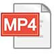

# Quake Trackr

This application was designed and developed as part of the [Mobile Platform Development module][2] at [Glasgow Caledonian University][3].

The brief was to create a mobile application which consumed a data feed on UK Earthquakes from the [British Geological Survey][1]. The earthquakes should then be displayed to the user in a meaningful way.

## YouTube Walkthrough

[1]: https://youtu.be/woTzVRbaMSI?
You can [view a walkthrough][1] of the application on YouTube by clicking the link below.
[][1]

### Low-res Video Download
[][4]

A _low-resolution_ MP4 can be downloaded from the GitHub repo [here][4].

### Contents
Below is a break down of the walkthrough. Click on the time marker to access directly.

1. [0:04](https://youtu.be/woTzVRbaMSI?t=4) Loading app with no connection and no saved data
2. [0:22](https://youtu.be/woTzVRbaMSI?t=22) Loading app with connection to initially download data
3. [0:35](https://youtu.be/woTzVRbaMSI?t=35) Loading app with no connection but existing data
4. [0:43](https://youtu.be/woTzVRbaMSI?t=43) Dashboard walkthrough
5. [1:10](https://youtu.be/woTzVRbaMSI?t=70) List view walkthrough
6. [1:34](https://youtu.be/woTzVRbaMSI?t=94) Map walkthrough
7. [1:58](https://youtu.be/woTzVRbaMSI?t=118) Map marker cluster demo
8. [2:14](https://youtu.be/woTzVRbaMSI?t=134) Search functionality
9. [4:20](https://youtu.be/woTzVRbaMSI?t=260) Lanscape views
10. [5:00](https://youtu.be/woTzVRbaMSI?t=300) Refreshing data from feed

## Run / Clone Instructions
To run this application, you will need Android Studio _(Version 3.3 or higher)_.

Clone the repository to your machine
```
git clone https://github.com/cjconnor24/MobilePlatformDevelopmentCW.git
```
Open as an existing project in Android Studio.

## APK Download
[][5]

You can download the APK installer by clicking [here][5] or clicking the icon above.

# Copyright Notice
Please note, all data displayed in the use of this app belongs to the [British Geological Survey][1]. Further information can be found on their website.

[1]: https://www.bgs.ac.uk
[2]: https://www.gcu.ac.uk//study/modules/info/?Module=MHI322959
[3]: https://www.gcu.ac.uk/
[4]: https://github.com/cjconnor24/MobilePlatformDevelopmentCW/raw/master/Documents/QuakeTrackr_Git.mp4
[5]: https://github.com/cjconnor24/MobilePlatformDevelopmentCW/raw/master/Documents/QuakeTrackr.apk
